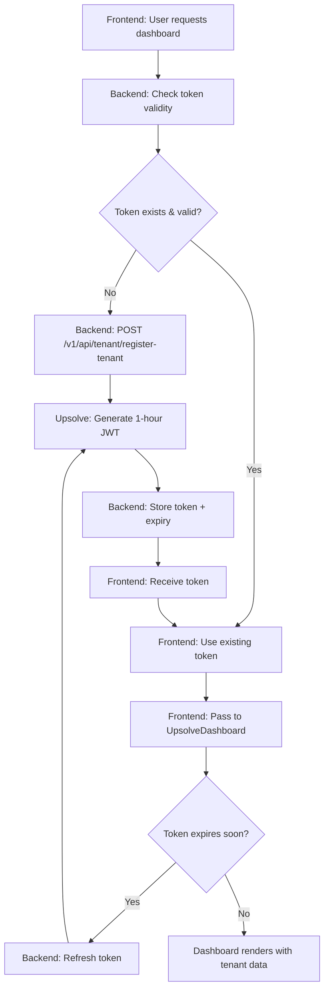

## Overview

The tenant registration flow involves coordination between your frontend application, backend services, and the Upsolve API to securely register tenants and manage their access tokens.

## Key Requirements

<Warning>
**Critical Implementation Points:**
- **Token must be passed to frontend** - Required for UpsolveDashboard component
- **1-hour expiration** - Tokens expire after 1 hour and must be refreshed
- **No server-side caching** - Upsolve does not cache/store permissions for users
- **Fresh token required** - Each dashboard view requires a valid, current token
</Warning>

## Critical Data Flow



## Step-by-Step Process

### 1. Initial Tenant Registration

**Frontend Request**
```http
POST /upsolve/tenant/register
```
OR
```http
POST /upsolve/tenant/refresh-token
```

**Backend to Upsolve API**
```http
POST /v1/api/tenant/register-tenant
Content-Type: application/json
{
  "apiKey": "your-api-key",
  "displayName": "Customer ABC Corp",
  "prefilters_schema": "customer_schema_1",
  "tenantEditingPermissions": {
    "addChart": true,
    "createChart": false,
    "editCharts": true,
    "readOnly": false
  }
}
```

**Upsolve Response**
```http
200 OK
{
  "token": "eyJhbGciOiJIUzI1NiIsInR5cCI6IkpXVCJ9...",
  "expiresIn": 3600
}
```

### 2. Token Storage

The backend should save the token and expiry information to the `UpsolveTenant` model/entity for future use.

### 3. Permission Retrieval

**Frontend Request**
```http
GET /upsolve/permissions/tenant-settings/
Authorization: Bearer {token}
```

**Response**
```json
{
  "addChart": true,
  "createChart": false,
  "editCharts": true,
  "readOnly": false
}
```

The backend updates the user's role in Corvin using signals to reflect these permissions.

### 4. Token Refresh

Since tokens expire after 1 hour, implement a refresh mechanism:

**Frontend Request**
```http
POST /v1/api/tenant/register-tenant
Content-Type: application/json
{
  "apiKey": "your-api-key",
  "displayName": "Customer ABC Corp", 
  "tenantEditingPermissions": {
    "addChart": true,
    "createChart": false,
    "editCharts": true,
    "readOnly": false
  }
}
```

**New Token Response**
```http
200 OK
{
  "token": "eyJhbGciOiJIUzI1NiIsInR5cCI6IkpXVCJ9...",
  "expiresIn": 3600
}
```

### 5. Frontend Integration

Pass the valid token to the UpsolveDashboard component:

```javascript
<UpsolveDashboard 
  token={upsolveTenant.token}
  // other props
/>
```

## Implementation Details

### Token Management

- **Expiration**: Tokens expire after 1 hour
- **No Caching**: Upsolve does not cache or store permissions - fresh tokens required
- **Frontend Requirement**: Token must be passed to frontend for dashboard rendering
- **Refresh Strategy**: Implement automatic refresh before expiration
- **Storage**: Store tokens securely in your backend database
- **Validation**: Always check token validity before dashboard rendering

### Error Handling

**Common Error Scenarios:**

**Invalid API Key**
```http
401 Unauthorized
{
  "error": "Invalid API key"
}
```

**Expired Token**
```http
401 Unauthorized  
{
  "error": "Token expired"
}
```

**Invalid Tenant Configuration**
```http
400 Bad Request
{
  "error": "Missing required prefilters"
}
```

### Security Considerations

- **API Key Protection**: Never expose API keys in frontend code
- **Token Scope**: Tokens are tenant-specific and cannot access other tenant data
- **HTTPS Required**: All API communications must use HTTPS
- **Token Rotation**: Implement regular token refresh cycles

## Frontend Integration Requirements

<Info>
**Critical**: The token must be passed to the frontend since Upsolve does not store user permissions server-side. Each dashboard render requires a valid token.
</Info>

### Token Passing

The frontend must receive and use the token from the backend:

```typescript
interface UpsolveTenant {
  token: string;
  expiresAt: Date;
  permissions: {
    addChart: boolean;
    createChart: boolean;
    editCharts: boolean;
    readOnly: boolean;
  };
}
```

### Dashboard Component

```tsx
import { UpsolveDashboard } from '@upsolve/dashboard';

function Dashboard({ upsolveTenant }: { upsolveTenant: UpsolveTenant }) {
  // Check token validity
  if (new Date() > upsolveTenant.expiresAt) {
    // Trigger token refresh
    refreshToken();
    return <LoadingSpinner />;
  }

  return (
    <UpsolveDashboard
      token={upsolveTenant.token}
      permissions={upsolveTenant.permissions}
    />
  );
}
```

### Automatic Refresh

Implement automatic token refresh:

```typescript
const useTokenRefresh = (tenant: UpsolveTenant) => {
  useEffect(() => {
    const timeUntilExpiry = tenant.expiresAt.getTime() - Date.now();
    const refreshTime = Math.max(timeUntilExpiry - 300000, 0); // Refresh 5 min before expiry

    const timer = setTimeout(() => {
      refreshTenantToken(tenant.id);
    }, refreshTime);

    return () => clearTimeout(timer);
  }, [tenant]);
};
```